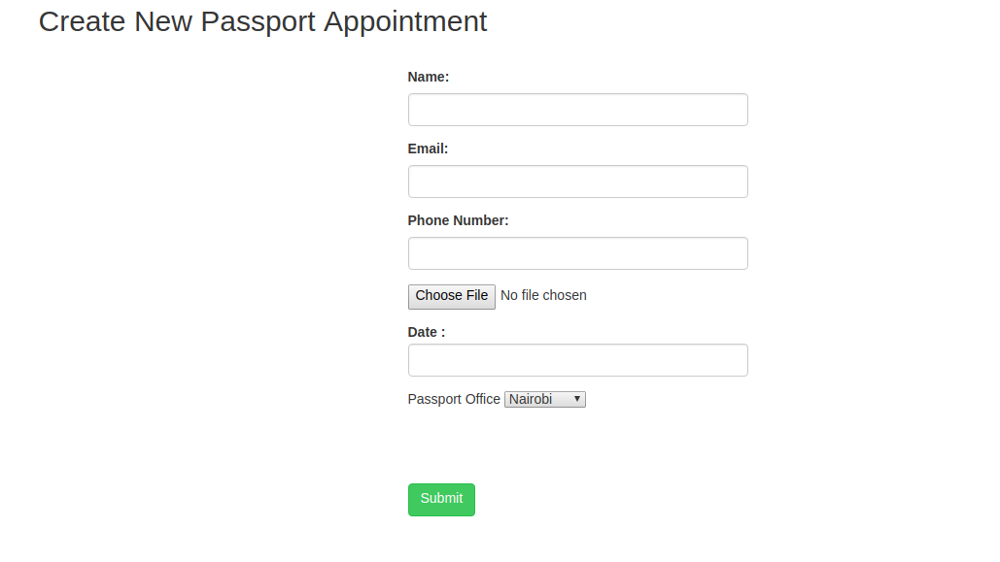
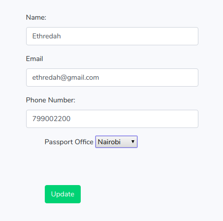

## About 
This is a simple passport appointment system build with the Laravel Web Framework.
<br>
The application demonstrates creating a new appointment, editing an existing appointment, deleting appointment, reading/ viewing all appointments and pagination.


### Tutorial

* Step 1 : 
Configure Laravel 5.6

`composer create-project --prefer-dist laravel/laravel passportappointmentsystem`


* Step 2 : 
Configure Database in the .env file

```sql
DB_CONNECTION=mysql
DB_HOST=127.0.0.1
DB_PORT=3306
DB_DATABASE=databasename
DB_USERNAME=root
DB_PASSWORD=
```

* Step 3 : 
Migrate the two tables provided by Laravel and type the following command on terminal.

`php artisan migrate`

This will build two tables :
-  Users
-  Password_reset

* Step 4 : 
Construct Model, Migration File and Controller
`
php artisan make:model Passport -m
`

* Step 5 :
Create a Schema for the passports table in the migration file : 

`public function up()
    {
        Schema::create('passports', function (Blueprint $table) {
            $table->increments('id');
            $table->string('name');
            $table->integer('date');
            $table->string('email')->unique();
            $table->integer('number');
            $table->string('office');
            $table->string('filename');
            $table->timestamps();
        });
    }
`

Migrate the table :
`php artisan migrate`

* Step 6 : 
Create Controller and Routes
`Route::resource('passports','PassportController');`


## Quick Start

* Download repository / clone.
* Create a database to store the application data.
* Modify the .env file and add your database details.
* Cd to the project directory and serve `php artisan serve`

_View All Appointments_


_Create New Appointment_



_Edit An Appointment_



## License

The Laravel framework is open-sourced software licensed under the [MIT license](https://opensource.org/licenses/MIT).

